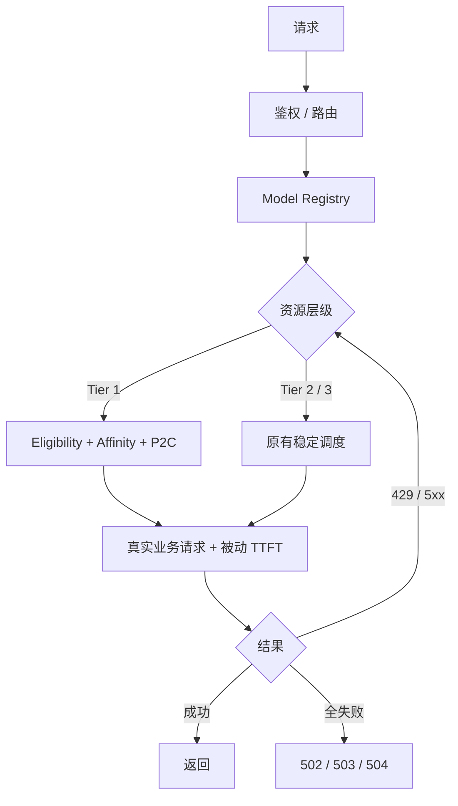

<div align="center">

# ai-gateway

**多 API · 多 Key · 多模型 · 一个稳定端点**

把一堆容易限流、失效、抖动的上游 Key，聚合为一个稳定、自动恢复的 AI API。


[本地安装](#本地安装) · [自动部署](#自动部署) · [配置](#配置) · [端点](#端点) · [安全](#安全)

</div>

---

## 一图看懂



## 核心能力

| Tier 1 自适应 | 429 隔离 | 被动恢复 | 分层兜底 |
|---|---|---|---|
| Affinity + P2C | Retry-After 冷却 | 真实请求 HALF_OPEN | tier 硬优先级 |

- 多协议：OpenAI Chat / Responses、Anthropic Messages / count_tokens
- 原生协议转发：Chat → 上游 `/v1/chat/completions`，Responses → 上游 `/v1/responses`，Messages → 上游 `/v1/messages`；节点通过 `protocol` + `surfaces` 显式声明，任何提供 OpenAI-compatible 或 Anthropic-compatible API 的服务均可接入
- Native First：OpenAI Chat / Responses 只走原生路径；Anthropic Messages 优先原生，原生池耗尽后可选转换到 OpenAI Chat（通过 `PROTOCOL_FALLBACKS` 显式配置，仅支持 Anthropic → OpenAI Chat 单向转换）
- `limits.rpm` 默认 hard，单 Worker isolate 内不主动越配额
- 整请求 failover budget，超时即停
- Tier 1 只从真实业务输出学习 `(account, model)` TTFT：不主动测速，不用 health、LRU 或静态 priority 排序；它不承诺每次选到全局最快账户，而是追求低成本、快速避障、自然均衡和会话连续
- Tier 1 会话亲和通过跨 isolate 的 Cloudflare KV 保存；其余短期 TTFT、inFlight、cooldown 与 half-open 状态仍是 isolate-local best-effort 状态
- Tier 2 / Tier 3 保持原有稳定 fallback 与 circuit 行为

## 本地安装

先创建 Cloudflare KV namespace；安装脚本会要求输入其 32 位 ID，并生成必需的 `TIER1_AFFINITY` binding。

```bash
git clone https://github.com/fongap/ai-gateway.git && cd ai-gateway
npm ci
sh scripts/install.sh     # Windows: powershell scripts/install.ps1
```

## 自动部署

生产环境将 Fork 专属的非敏感 Worker 配置保存在 GitHub 仓库 Variable，将网关和上游密钥保存在 GitHub 仓库 Secret。完成一次性初始化后，只需要推送 `main`：

```bash
git push origin main
```

将 KV namespace ID 配置为 GitHub Variable `TIER1_AFFINITY_KV_ID`。工作流会自动校验配置、生成 KV binding、同步 Worker 文本变量和 Worker 密钥、执行 D1 数据库迁移、部署 Worker，并对 `/health`、`/v1/models` 和 Claude `count_tokens` 执行线上健康检查。部署不会保留 Cloudflare 控制台中的旧文本变量。一次性初始化步骤见 **[docs/operations/deployment.md](docs/operations/deployment.md)**。

## 配置

节点定义存入 Worker 文本变量；上游凭据和网关访问密钥存入 Worker 密钥：

```json
{ "id": "nvidia-01", "provider": "nvidia", "priority": 10,
  "base_url": "https://integrate.api.nvidia.com/v1",
  "models": { "general-air": "deepseek-ai/deepseek-v3.1" },
  "limits": { "concurrency": 3, "rpm": 40 } }
```

| 配置项 | 作用 |
|---|---|
| `TIER{1,2,3}_NODES_CONFIG_01..` | 各层节点池 |
| `NODE_SECRETS_01..` | `{ node-id: credential }` |
| `GATEWAY_ACCESS_KEY` | 网关访问密钥 |
| `TIER1_AFFINITY` | 必需的 Cloudflare KV binding；保存哈希 session key → Tier 1 account，30 分钟 TTL |
| `TOKEN_STATS_DB` | 可选 D1 binding；token usage 分层存储：totals（累计）、daily/weekly（52 周）、hourly/model_hourly（7 天），定时聚合与清理 |

`priority` 保留在共享节点 schema 中用于 Tier 2/3 兼容性，但 Tier 1 P2C 有意忽略它。

> 完整字段、运行参数、Model Registry 和部署配置示例见 **[docs/operations/configuration.md](docs/operations/configuration.md)**。

## 端点

| 方法 | 路径 | 说明 |
|---|---|---|
| POST | `/v1/chat/completions` | OpenAI Chat |
| POST | `/v1/responses` | OpenAI Responses |
| POST | `/v1/messages` · `/count_tokens` | Anthropic Messages |
| GET | `/` · `/version` | 入口页 · 版本 |
| GET | `/health` `/metrics` `/v1/models` | 诊断（需鉴权） |

客户端可通过 `x-session-id`（8–128 字符）启用 Tier 1 session affinity。原始值在成为 KV key 前经 SHA-256 哈希，从不记录日志。

## 安全

- Bearer / `x-api-key`，timing-safe 比较；Header allowlist；HTTPS 强制
- Credential 永不外泄；CORS 默认关闭
- 默认隐藏节点/拓扑，只暴露 attempts 计数与 `failure_kinds`

---

<div align="center">

**ai-gateway** · 多 Key · 多模型 · 一个稳定端点 · [MIT](LICENSE)

[架构](docs/architecture/overview.md) · [配置](docs/operations/configuration.md) · [部署](docs/operations/deployment.md)

</div>
