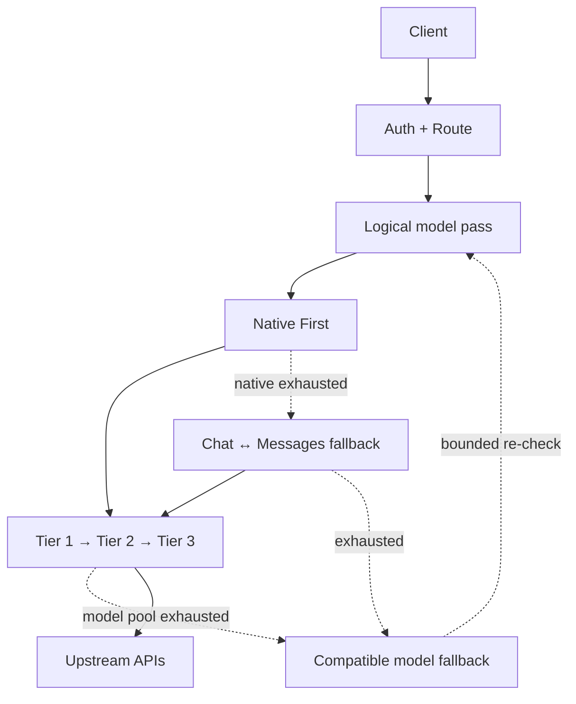

<div align="center">

# AI-Gateway

**Turn fragmented AI capacity into one stable endpoint.**

Cloudflare Workers · Multi-provider routing · Multi-key load balancing · Rate limiting · Tiered failover · OpenAI/Anthropic compatibility

[**English**](README.md) · [简体中文](README.zh-CN.md)

[](https://github.com/fongap/ai-gateway/actions/workflows/ci.yml)
[](https://github.com/fongap/ai-gateway/actions/workflows/deploy.yml)


[Live Dashboard](https://api.135468.xyz/) · [Quick Start](#quick-start) · [Architecture](docs/architecture/overview.md) · [Configuration](docs/operations/configuration.md) · [Deployment](docs/operations/deployment.md) · [Documentation](docs/README.md)

</div>

ai-gateway aggregates heterogeneous AI providers, API keys, and logical model aliases behind one predictable endpoint. It is built to maximize the useful capacity of low-cost and failure-prone resources while preserving scarce or premium capacity for higher-value workloads.

## Why ai-gateway

Low-cost AI capacity is often fragmented across providers and accounts, constrained by real provider limits that are not always published, and uneven in latency and availability. ai-gateway treats that capacity as a pool: it spreads load across usable resources, reacts to real 429/failure evidence, and moves through configured fallback tiers under one request budget instead of relying on a single "best" key or guessed per-node limits.

With tiered routing, operators can place abundant or lower-cost capacity earlier in the path and keep scarcer or premium resources available for workloads that need them. The goal is not simply to pick the fastest upstream, but to improve **availability, quota utilization, and predictable recovery** across the whole pool.

**Live dashboard:** [api.135468.xyz](https://api.135468.xyz/) — current model availability, traffic, token activity, and client quick-start examples.

## Highlights

| Capability | Current behavior |
| --- | --- |
| **Multi-key resilience** | P2C selection, passive TTFT learning, live in-flight soft load, 429 cooldown and provider-model heat |
| **Tiered failover** | Route through **Tier 1 → Tier 2 → Tier 3** under one request budget |
| **Model-family fallback** | Bounded recovery across compatible aliases with reserved first-round capacity: `Code-Max ↔ Code-Pro → Code-Ultra`, `Max ↔ Pro → Ultra`, and one-way `Air → Pro → Max → Ultra` |
| **Multi-provider routing** | Aggregate independent providers, keys, and logical model aliases behind one gateway |
| **Protocol compatibility** | Native OpenAI Chat, OpenAI Responses, and Anthropic Messages |
| **Safe protocol fallback** | OpenAI Chat ↔ Anthropic Messages only; **OpenAI Responses is Native Only** for protocol conversion |
| **Streaming & observability** | Protocol-aware first-event guards, guarded SSE, sanitized diagnostics, token-usage aggregation |

Designed for heterogeneous OpenAI-compatible and Anthropic-compatible upstreams, including coding-agent and Claude Code workloads.

## Architecture



Native execution always comes first. Cross-protocol fallback and logical-model family fallback share the same logical-attempt, dispatch, hedge, and wall-clock failover budgets. Configured three-model families reserve first-round logical attempts as **3 / 2 / 1** in requested-model preference order; `Air` uses **3 / 1 / 1 / 1** across its one-way upward chain. The bounded re-check round can only use request budget left unused by the first round.

Code models never fall back into the non-Code family. `Air` may move upward to `Pro → Max → Ultra`, but `Ultra` / `Max` / `Pro` never fall back down to `Air`. A model-shaped 404 remains isolated to the failing model mapping and does not trigger a model-family switch. If a complete family sweep fails only for transient capacity reasons, the gateway returns retryable `503` so coding clients can retry instead of stopping for manual continuation.

Tier 1 is intentionally biased toward **stable capacity, not a single "best" key**. Live in-flight work is a bounded soft ranking signal, affinity weakens as a key gets busy, real 429s drive cooldown/recovery, provider-model 429 heat can softly demote a hot cohort, and optional hedge work yields before primary traffic. A configured legacy `limits.concurrency` value never hard-blocks the only healthy node.

## API surface

| Method | Path | Surface |
| --- | --- | --- |
| `POST` | `/v1/chat/completions` | OpenAI Chat Completions |
| `POST` | `/v1/responses` | OpenAI Responses |
| `POST` | `/v1/messages` | Anthropic Messages |
| `POST` | `/v1/messages/count_tokens` | Anthropic-compatible local token count |
| `GET` | `/v1/models` | Model catalog |
| `GET` | `/health` | Authenticated health diagnostics |
| `GET` | `/version` | Source version and deployed-build identity |

## Quick start

Requirements: Node.js **>=22.18.0** and a Cloudflare account for deployment.

```bash
git clone https://github.com/fongap/ai-gateway.git
cd ai-gateway
npm ci
sh scripts/install.sh
```

Windows:

```powershell
powershell scripts/install.ps1
```

For production, use the repository-driven workflow in [Deployment](docs/operations/deployment.md).

## Configuration model

| Layer | Configuration |
| --- | --- |
| Nodes | `TIER{1,2,3}_NODES_CONFIG_01..10` |
| Upstream credentials | `TIER{1,2,3}_NODES_SECRETS_01..10` |
| Gateway access | `GATEWAY_ACCESS_KEY_{AIR,PRO,MAX,ULTRA,AGENT}` |
| Model access | `GATEWAY_ACCESS_MODELS_{AIR,PRO,MAX,ULTRA,AGENT}` |
| Model / request policy | `MODELS_CONFIG` · `POLICIES_CONFIG` |

Credentials bind by **Tier + node id**; Config and Secret shard suffixes are independent partitions. Gateway access is fail-closed: a configured access key with a missing or empty model allowlist grants no model access.

Node `limits` are retired from active configuration. Existing syntactically-valid legacy objects are accepted temporarily for migration safety but no longer define provider capacity; remove them from maintained configs.

See [Configuration](docs/operations/configuration.md) for the complete node schema, runtime variables, model-family and protocol fallback settings, and Cloudflare bindings.

## Production flow

```text
Pull Request
    ↓
validate-merge
    ↓
squash merge to main
    ↓
validate-deploy
    ↓
Worker deploy
    ↓
remote verification
    ↓
success / automatic Worker rollback
```

Documentation-only commits are intentionally excluded from Worker redeployment.

## Documentation

| Area | Purpose |
| --- | --- |
| [Architecture](docs/architecture/overview.md) | Durable system boundaries, routing, protocol and reliability contracts |
| [Operations](docs/operations/configuration.md) | Configuration, deployment, troubleshooting and provider discovery |
| [Governance](docs/governance/README.md) | Development, quality, dependency, version/tag and documentation policy |
| [CHANGELOG](CHANGELOG.md) | Version history |

English is the canonical documentation language. The [Simplified Chinese README](README.zh-CN.md) is maintained as a reader-facing translation; executable behavior, tests, schemas and the English canonical documentation remain the source of truth.

## Security

Never place upstream credentials in node configuration or public logs. See [SECURITY.md](SECURITY.md) for secret handling and vulnerability reporting.

## License

MIT License. See [LICENSE](LICENSE).
