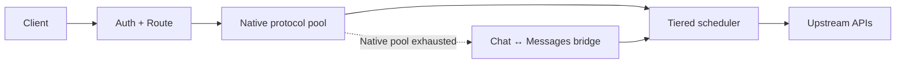

<div align="center">

# ai-gateway

**Resilient AI API gateway for Cloudflare Workers**

Multi-provider routing · Multi-key load balancing · Rate limiting · Tiered failover · OpenAI/Anthropic compatibility

[**English**](README.md) · [简体中文](README.zh-CN.md)


[Live Dashboard](https://api.135468.xyz/) · [Quick Start](#quick-start) · [Architecture](docs/architecture/overview.md) · [Configuration](docs/operations/configuration.md) · [Deployment](docs/operations/deployment.md) · [Documentation](docs/README.md)

</div>

ai-gateway turns heterogeneous AI providers, API keys, and logical models into one stable endpoint. It is built for high-volume, failure-prone upstream pools where **availability, quota protection, and predictable failover** matter more than simply picking the fastest key.

**Live dashboard:** [api.135468.xyz](https://api.135468.xyz/) — current model availability, traffic, token activity, and client quick-start examples.

## Highlights

| Capability | Current behavior |
| --- | --- |
| **Multi-provider routing** | Aggregate independent providers, keys, and logical model aliases behind one gateway |
| **Tiered failover** | Route through **Tier 1 → Tier 2 → Tier 3** under one request budget |
| **Multi-key resilience** | P2C selection, passive TTFT learning, concurrency/RPM shaping, cooldown and heat protection |
| **Protocol compatibility** | Native OpenAI Chat, OpenAI Responses, and Anthropic Messages |
| **Safe fallback** | OpenAI Chat ↔ Anthropic Messages only; **OpenAI Responses is Native Only** |
| **Streaming & observability** | Protocol-aware first-event guards, guarded SSE, sanitized diagnostics, token-usage aggregation |

Designed for heterogeneous OpenAI-compatible and Anthropic-compatible upstreams, including coding-agent and Claude Code workloads.

## Architecture



Native execution always comes first. Cross-protocol fallback shares the same logical-attempt and wall-clock failover budget; hedge twins never cross protocol boundaries.

Tier 1 is intentionally biased toward **stable capacity, not a single "best" key**. RPM headroom can soften selection before a hard limit, affinity weakens as a key gets hot, and optional hedge twins require spare RPM/concurrency capacity.

## API surface

| Method | Path | Surface |
| --- | --- | --- |
| `POST` | `/v1/chat/completions` | OpenAI Chat Completions |
| `POST` | `/v1/responses` | OpenAI Responses |
| `POST` | `/v1/messages` | Anthropic Messages |
| `POST` | `/v1/messages/count_tokens` | Anthropic-compatible local token count |
| `GET` | `/v1/models` | Model catalog |
| `GET` | `/health` | Authenticated health diagnostics |
| `GET` | `/version` | Source version and deployed-build identity |

## Quick start

Requirements: Node.js **>=22.18.0** and a Cloudflare account for deployment.

```bash
git clone https://github.com/fongap/ai-gateway.git
cd ai-gateway
npm ci
sh scripts/install.sh
```

Windows:

```powershell
powershell scripts/install.ps1
```

For production, use the repository-driven workflow in [Deployment](docs/operations/deployment.md).

## Configuration model

| Layer | Configuration |
| --- | --- |
| Nodes | `TIER{1,2,3}_NODES_CONFIG_01..10` |
| Upstream credentials | `TIER{1,2,3}_NODES_SECRETS_01..10` |
| Gateway access | `GATEWAY_ACCESS_KEY_{AIR,PRO,MAX,ULTRA,AGENT}` |
| Model access | `GATEWAY_ACCESS_MODELS_{AIR,PRO,MAX,ULTRA,AGENT}` |
| Model / request policy | `MODELS_CONFIG` · `POLICIES_CONFIG` |

Credentials bind by **Tier + node id**; Config and Secret shard suffixes are independent partitions. Gateway access is fail-closed: a configured access key with a missing or empty model allowlist grants no model access.

See [Configuration](docs/operations/configuration.md) for the complete node schema, runtime variables, protocol fallback settings, RPM behavior, and Cloudflare bindings.

## Production flow

```text
Pull Request
    ↓
validate-merge
    ↓
squash merge to main
    ↓
validate-deploy
    ↓
Worker deploy
    ↓
remote verification
    ↓
success / automatic Worker rollback
```

Documentation-only commits are intentionally excluded from Worker redeployment.

## Documentation

| Area | Purpose |
| --- | --- |
| [Architecture](docs/architecture/overview.md) | Durable system boundaries, routing, protocol and reliability contracts |
| [Operations](docs/operations/configuration.md) | Configuration, deployment, troubleshooting and provider discovery |
| [Governance](docs/governance/README.md) | Development, quality, dependency, version/tag and documentation policy |
| [CHANGELOG](CHANGELOG.md) | Version history |

English is the canonical documentation language. The [Simplified Chinese README](README.zh-CN.md) is maintained as a reader-facing translation; executable behavior, tests, schemas and the English canonical documentation remain the source of truth.

## Security

Never place upstream credentials in node configuration or public logs. See [SECURITY.md](SECURITY.md) for secret handling and vulnerability reporting.

## License

MIT License. See [LICENSE](LICENSE).
