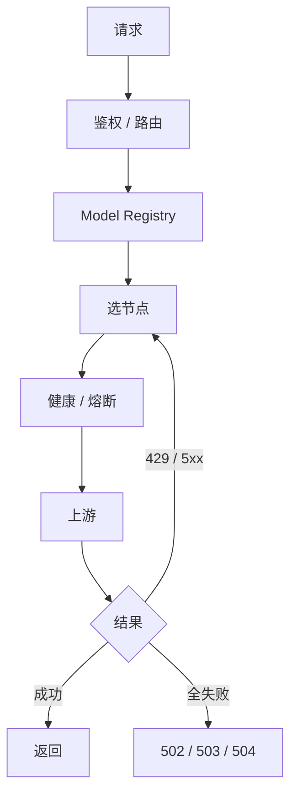

<div align="center">

# ai-gateway

**多 API · 多 Key · 多模型 · 一个稳定端点**

把一堆容易限流、失效、抖动的上游 Key，聚合为一个稳定、自动恢复的 AI API。


[快速开始](#快速开始) · [配置](#配置) · [端点](#端点) · [安全](#安全)

</div>

---

## 一图看懂



## 核心能力

| 轮转摊流 | 429 隔离 | 熔断自愈 | 分层兜底 |
|---|---|---|---|
| priority + LRU | Retry-After 冷却 | HALF_OPEN 单探测 | tier 硬优先级 |

- 多协议：OpenAI Chat / Responses、Anthropic Messages / count_tokens
- `limits.rpm` 默认 hard，单 Worker isolate 内不主动越配额
- 整请求 failover budget，超时即停

## 快速开始

```bash
git clone https://github.com/fongap/ai-gateway.git && cd ai-gateway
npm ci
sh scripts/install.sh     # Windows: powershell scripts/install.ps1
```

## 配置

节点是普通变量，凭据是独立 Secret：

```json
{ "id": "nvidia-01", "provider": "nvidia", "priority": 10,
  "base_url": "https://integrate.api.nvidia.com/v1",
  "models": { "general-air": "deepseek-ai/deepseek-v3.1" },
  "limits": { "concurrency": 3, "rpm": 40 } }
```

| 变量 | 作用 |
|---|---|
| `TIER{1,2,3}_NODES_CONFIG_01..` | 各层节点池 |
| `NODE_SECRETS_01..` | `{ node-id: credential }` |
| `GATEWAY_ACCESS_KEY` | 客户端密钥 |

> 完整字段、运行参数、Model Registry、示例见 **[docs/CONFIGURATION.md](docs/CONFIGURATION.md)**。

## 端点

| 方法 | 路径 | 说明 |
|---|---|---|
| POST | `/v1/chat/completions` | OpenAI Chat |
| POST | `/v1/responses` | OpenAI Responses |
| POST | `/v1/messages` · `/count_tokens` | Anthropic Messages |
| GET | `/` · `/version` | 入口页 · 版本 |
| GET | `/health` `/metrics` `/v1/models` | 诊断（需鉴权） |

## 安全

- Bearer / `x-api-key`，timing-safe 比较；Header allowlist；HTTPS 强制
- Credential 永不外泄；CORS 默认关闭
- 默认隐藏节点/拓扑，只暴露 attempts 计数与 `failure_kinds`

---

<div align="center">

**ai-gateway** · 多 Key · 多模型 · 一个稳定端点 · [MIT](LICENSE)

[架构](docs/ARCHITECTURE.md) · [配置](docs/CONFIGURATION.md) · [部署](docs/DEPLOYMENT.md)

</div>
