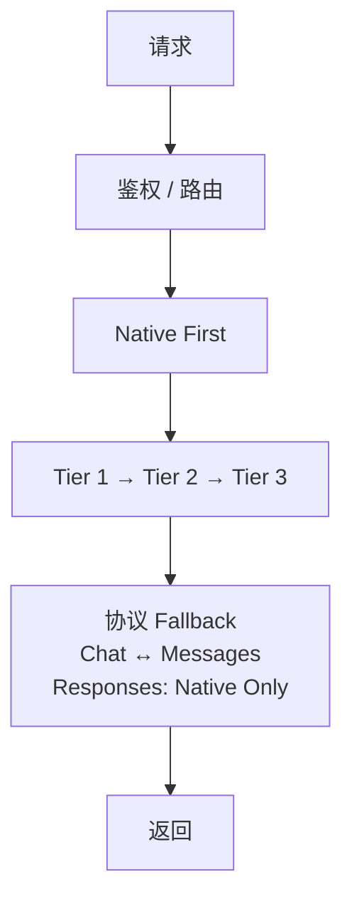

# ai-gateway

**多 API · 多 Key · 多模型 · 一个端点**

将多个 AI API、Key 和模型聚合为一个统一端点，自动处理限流、故障切换和协议兼容。

当前版本：**1.3.1**


[快速开始](#快速开始) · [配置](#配置) · [API](#api) · [文档](#文档) · [English](README_EN.md)



## 能力

| 能力 | 说明 |
| --- | --- |
| 多协议 | OpenAI Chat / Responses、Anthropic Messages |
| 多节点 | 多 API、多 Key、多模型统一接入 |
| 分层调度 | Tier 1 → Tier 2 → Tier 3 |
| 故障切换 | 429、5xx、超时自动换节点 |
| 协议兜底 | Chat ↔ Messages；Responses 原生直连 |
| 会话亲和 | Tier 1 支持跨 isolate 会话绑定 |

## 快速开始

```bash
git clone https://github.com/fongap/ai-gateway.git
cd ai-gateway
npm ci
sh scripts/install.sh
```

Windows：

```powershell
powershell scripts/install.ps1
```

生产部署见 [docs/operations/deployment.md](docs/operations/deployment.md)。

## 配置

```json
{
  "id": "node-01",
  "provider": "example",
  "protocol": "openai",
  "surfaces": ["chat_completions"],
  "base_url": "https://api.example.com/v1",
  "priority": 10,
  "models": {
    "code": "upstream-model"
  },
  "limits": {
    "concurrency": 3,
    "rpm": 40
  }
}
```

| 配置 | 作用 |
| --- | --- |
| `TIER*_NODES_CONFIG_*` | 节点配置 |
| `TIER*_NODES_SECRETS_*` | 节点凭据 |
| `GATEWAY_ACCESS_KEY_{AIR,PRO,MAX,ULTRA,AGENT}` | 五组网关访问 Key；至少配置一组 |
| `GATEWAY_ACCESS_MODELS_{AIR,PRO,MAX,ULTRA,AGENT}` | 对应 Group 的模型 allowlist |
| `MODELS_CONFIG` | 模型配置 |
| `POLICIES_CONFIG` | 调度策略 |

每个 Access Group 独立。配置某组 Key 时应同时明确配置该组 Models；Models 缺失或为空时该 Key 不获得任何模型权限。未配置任何分组 Key 时，网关按 fail-closed 原则不接受客户端鉴权。

Secret 必须与节点属于同一 Tier，并通过 node id 绑定；`01..10` 仅为分片编号，Config shard 与 Secret shard 的 suffix 不要求一致。

## API

| 方法 | 路径 | 协议 / 用途 |
| --- | --- | --- |
| POST | `/v1/chat/completions` | OpenAI Chat |
| POST | `/v1/responses` | OpenAI Responses |
| POST | `/v1/messages` | Anthropic Messages |
| POST | `/v1/messages/count_tokens` | Anthropic Token Count |
| GET | `/v1/models` | 模型列表 |
| GET | `/health` | 健康检查 |

## 文档

| 主题 | 文档 |
| --- | --- |
| 架构 | [系统架构](docs/architecture/overview.md) |
| 配置 | [配置说明](docs/operations/configuration.md) |
| 部署 | [部署说明](docs/operations/deployment.md) |
| 可靠性 | [可靠性模型](docs/architecture/reliability-model.md) |
| 安全 | [质量与安全](docs/governance/quality-policy.md) |

## License

MIT License. See [LICENSE](LICENSE).
