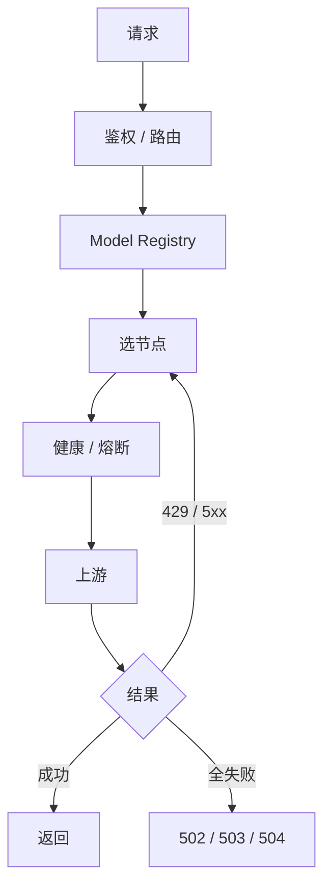

<div align="center">

# ai-gateway

**多 API · 多 Key · 多模型 · 一个稳定端点**

把一堆容易限流、失效、抖动的上游 Key，聚合为一个稳定、自动恢复的 AI API。


[本地安装](#本地安装) · [自动部署](#自动部署) · [配置](#配置) · [端点](#端点) · [安全](#安全)

</div>

---

## 一图看懂



## 核心能力

| 轮转摊流 | 429 隔离 | 熔断自愈 | 分层兜底 |
|---|---|---|---|
| priority + LRU | Retry-After 冷却 | HALF_OPEN 单探测 | tier 硬优先级 |

- 多协议：OpenAI Chat / Responses、Anthropic Messages / count_tokens
- 原生协议转发：Chat → 上游 `/v1/chat/completions`，Responses → 上游 `/v1/responses`，Messages → 上游 `/v1/messages`；节点通过 `protocol` + `surfaces` 显式声明，任何提供 OpenAI-compatible 或 Anthropic-compatible API 的服务均可接入
- 默认不做 OpenAI ↔ Anthropic 跨协议转换，也不做跨协议 fallback
- `limits.rpm` 默认 hard，单 Worker isolate 内不主动越配额
- 整请求 failover budget，超时即停

## 本地安装

```bash
git clone https://github.com/fongap/ai-gateway.git && cd ai-gateway
npm ci
sh scripts/install.sh     # Windows: powershell scripts/install.ps1
```

## 自动部署

生产环境将 Fork 专属的非敏感 Worker 配置保存在 GitHub 仓库 Variable，将网关和上游密钥保存在 GitHub 仓库 Secret。完成一次性初始化后，只需要推送 `main`：

```bash
git push origin main
```

工作流会自动校验配置、同步 Worker 文本变量和 Worker 密钥、执行 D1 数据库迁移、部署 Worker，并对 `/health`、`/v1/models` 和 Claude `count_tokens` 执行线上健康检查。部署不会保留 Cloudflare 控制台中的旧文本变量。一次性初始化步骤见 **[docs/DEPLOYMENT.md](docs/DEPLOYMENT.md)**。

## 配置

节点定义存入 Worker 文本变量；上游凭据和网关访问密钥存入 Worker 密钥：

```json
{ "id": "nvidia-01", "provider": "nvidia", "priority": 10,
  "base_url": "https://integrate.api.nvidia.com/v1",
  "models": { "general-air": "deepseek-ai/deepseek-v3.1" },
  "limits": { "concurrency": 3, "rpm": 40 } }
```

| 配置项 | 作用 |
|---|---|
| `TIER{1,2,3}_NODES_CONFIG_01..` | 各层节点池 |
| `NODE_SECRETS_01..` | `{ node-id: credential }` |
| `GATEWAY_ACCESS_KEY` | 网关访问密钥 |

> 完整字段、运行参数、Model Registry 和部署配置示例见 **[docs/CONFIGURATION.md](docs/CONFIGURATION.md)**。

## 端点

| 方法 | 路径 | 说明 |
|---|---|---|
| POST | `/v1/chat/completions` | OpenAI Chat |
| POST | `/v1/responses` | OpenAI Responses |
| POST | `/v1/messages` · `/count_tokens` | Anthropic Messages |
| GET | `/` · `/version` | 入口页 · 版本 |
| GET | `/health` `/metrics` `/v1/models` | 诊断（需鉴权） |

## 安全

- Bearer / `x-api-key`，timing-safe 比较；Header allowlist；HTTPS 强制
- Credential 永不外泄；CORS 默认关闭
- 默认隐藏节点/拓扑，只暴露 attempts 计数与 `failure_kinds`

---

<div align="center">

**ai-gateway** · 多 Key · 多模型 · 一个稳定端点 · [MIT](LICENSE)

[架构](docs/ARCHITECTURE.md) · [配置](docs/CONFIGURATION.md) · [部署](docs/DEPLOYMENT.md)

</div>
