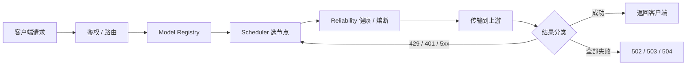

<div align="center">

# ai-gateway

**AI 聚合网关 · 多 API / 多 Key / 多模型，一个稳定端点**

多 Key 轮转摊流 · 429 隔离 · 熔断自恢复 · 分层兜底 · 流式首事件保护


[快速开始](#快速开始) · [Node 配置](#node-配置普通变量不含任何密钥) · [调度](#调度行为) · [端点](#端点) · [安全](#安全模型)

</div>

---

把多个容易限流、失效、抖动的上游 API / Key（免费或付费），聚合为一个稳定、轻量、自动恢复的统一 AI API。客户端只看到一个端点。

- OpenAI Chat Completions：`/v1/chat/completions`
- OpenAI Responses：`/v1/responses`（Codex / OpenCode 兼容，含 reasoning、function_call、流式事件）
- Anthropic Messages / Claude Code：`/v1/messages`
- Anthropic Token Count：`/v1/messages/count_tokens`

不做数据库、Redis、KV 状态同步、多租户、计费、Semantic Cache。运行状态是 Worker isolate 内存中的 best-effort 状态。

---

## 能力总览

| | 调度 | 可靠性 | 协议 | 安全 |
|---|---|---|---|---|
| 选择 | 动态候选集，每次尝试前 O(n) 重算 | 429 冷却 / Retry-After | Chat / Responses / Messages | Bearer / `x-api-key` timing-safe |
| 轮转 | priority + LRU 摊流 | Circuit Breaker 熔断 | 全上游走 Chat Completions | Header allowlist |
| 兜底 | Tier 硬优先级 fallback | HALF_OPEN 单探测恢复 | Responses / Messages 网关内转换 | Credential 永不外泄 |
| 限流 | `limits.rpm` 默认 hard | 半开探测无泄漏 | Anthropic 本地 count_tokens | CORS 默认关闭 + CSP |

---

## 请求管线



职责边界：

```text
Model Registry  = 逻辑模型能做什么
Node            = 逻辑模型 → 上游模型
Scheduler       = 请求发给哪个节点
Reliability     = 节点当前是否值得用
Transport       = 如何与上游通信
```

## 快速开始

```bash
git clone https://github.com/fongap/ai-gateway.git
cd ai-gateway
npm ci
sh scripts/install.sh     # Windows: powershell scripts/install.ps1
```

install 会引导你完成：Worker 命名 → 项目校验 → Cloudflare 登录 → 输入 Node 配置 JSON → 输入 Credential JSON → 分片校验 → 部署 → 写入 Secrets → 在线验证。

---

## Node 配置（普通变量，不含任何密钥）

典型配置是**多 Key、多账户、多模型**。下面的 tier-1 示例混跑了多个 provider 的账号，对外暴露多个逻辑模型：

```json
[
  { "id": "nvidia-01", "provider": "nvidia",   "base_url": "https://integrate.api.nvidia.com/v1", "priority": 10,
    "models": { "general-air": "deepseek-ai/deepseek-v3.1", "code-pro": "qwen/qwen3-coder-480b" }, "limits": { "concurrency": 3, "rpm": 40 } },
  { "id": "nvidia-02", "provider": "nvidia",   "base_url": "https://integrate.api.nvidia.com/v1", "priority": 10,
    "models": { "general-air": "deepseek-ai/deepseek-v3.1" }, "limits": { "concurrency": 3, "rpm": 40 } },
  { "id": "glm-01",    "provider": "zhipu",    "base_url": "https://open.bigmodel.cn/api/paas/v4", "priority": 20,
    "models": { "general-air": "glm-4.7", "code-max": "glm-4.7" }, "limits": { "concurrency": 2, "rpm": 30 } }
]
```

对应的凭据 Secret（`NODE_SECRETS_01`）：

```json
{ "nvidia-01": "nvapi-xxx", "nvidia-02": "nvapi-yyy", "glm-01": "zzzz.id" }
```

字段说明：

| 字段 | 说明 |
|---|---|
| `id` | 稳定主键；`^[a-z0-9][a-z0-9-]{0,63}$`；全仓库唯一 |
| `provider` | 可选标签，用于诊断展示 |
| `base_url` | 必须 `https://`；不允许内嵌用户名/密码 |
| `priority` | 数值越小优先级越高，默认 100；同层同级 = 轮转摊流 |
| `models` | 逻辑模型 → 上游模型映射；缺失 / 空对象 `{}` = 通配所有逻辑模型 |
| `limits.concurrency` | 节点并发上限，默认 2；**isolate 本地** shaping，非全局硬限 |
| `limits.rpm` | 该 key 每分钟请求配额。默认 **hard**：到量后不再派发，全耗尽返回 `503 + Retry-After`；`"rpm_mode": "soft"` 恢复旧 best-effort 破限行为 |

变量命名：

```text
TIER1_NODES_CONFIG_01, TIER2_NODES_CONFIG_01, ...   ← tier-1/2/3 资源池（普通变量）
NODE_SECRETS_01, ...                                 ← Secret：{ "node-id": "credential" }
GATEWAY_ACCESS_KEY                                   ← Secret：客户端访问密钥
```

- Tier 只由变量前缀决定；节点 JSON 中出现 `tier` 字段会被拒绝。
- 单片上限 4500 字节；分片按完整 Node 边界切分。
- 部署前校验：Duplicate ID、Missing / Orphan Credential、Invalid URL、非法字段（如 `prioirty`、`concurency`）都会提前失败，绝不悄悄猜。

---

## 调度行为


| 场景 | 行为 |
|---|---|
| 选择 | 单次 O(n) 扫描：priority ASC → activeRequests ASC → health（带内持平）→ LRU 轮转 → latency ASC |
| 并发分散 | 多个 concurrency=1 的节点自然摊开并发请求 |
| 429 | 只冷却当前节点，优先读 `Retry-After`（秒 / HTTP-date，钳制 1s–600s），同层其他节点继续服务 |
| RPM 配额 | `limits.rpm` 默认 hard：到量节点退出候选、优先用有额度的兄弟 key；全部耗尽返回 `503 + Retry-After`（指向分钟边界）；`rpm_mode: soft` 才允许破限 |
| 容量饱和 | 全部候选并发 / RPM 打满时返回 `503 + Retry-After`，让多智能体客户端退避 |
| 断流 | 中途断开 / 空闲超时：已缓冲字节送达，节点记为失败；透传流缺少 `[DONE]` 的提前关闭同样计为失败 |
| 401/403 | 视为凭据问题，该节点长冷却并退出当前请求候选 |
| 400/413/415/422 | 请求本身错误，立即返回，不换节点重放 |
| 5xx/网络/超时 | 失败计数 → 同层轮换 → 连续 3 次 OPEN 熔断 30s |
| Tier fallback | 仅当当前层没有任何 Eligible Node 时才进入下一层 |
| 自动恢复 | 冷却到期自动回池；OPEN → HALF_OPEN 单探测 → 成功 CLOSED |
| 流式 | 首个有效事件前可切换节点；之后绝不透明切换 |

Circuit 是连续失败状态机：CLOSED →(连续 3 次 5xx/网络/超时)→ OPEN →(30s)→ HALF_OPEN → 单探测 → 成功 CLOSED / 失败重新 OPEN。429 与 401 不计入熔断。半开探测若返回 429 / 401 / 404 / 客户端中止等非 counted 结果，视为节点存活：关闭电路、释放探测（绝不留下 `probeInFlight` 悬挂），冷却到期后可再次调度。

---

## 配置状态

| 状态 | 含义 |
|---|---|
| `unconfigured` | 关键配置不存在 |
| `invalid` | 存在结构性冲突（Duplicate ID 等）或零可用 Node；**禁止服务**（`ready=false`，请求返回 500） |
| `degraded` | 部分 Node 无效但仍可服务 |
| `ready` | 全部声明节点可用 |

`GET /health`（需鉴权）返回每个节点的健康、冷却、熔断与并发快照及配置诊断信息。

---

## 运行参数（全部可选）

| 变量 | 默认 | 说明 |
|---|---|---|
| `MAX_BODY_BYTES` | 20 MiB | 请求体上限 |
| `UPSTREAM_HEADERS_TIMEOUT_MS` | 120000 (5s–600s) | 上游响应头超时 |
| `FIRST_EVENT_TIMEOUT_MS` | 60000 (5s–600s) | 流式首事件超时 |
| `STREAM_IDLE_TIMEOUT_MS` | 120000 (10s–600s) | 流式空闲超时 |
| `RATE_LIMIT_COOLDOWN_MS` | 60000 (1s–600s) | 无 Retry-After 时的 429 冷却 |
| `AUTH_FAIL_COOLDOWN_MS` | 3600000 (1min–7d) | 401/403 凭据冷却 |
| `FAILOVER_BUDGET_MS` | 180000 (1s–900s) | 整请求故障转移总预算；到点停止轮转并返回 504 |
| `ALLOWED_ORIGIN` | 未设置 | 未设置时 CORS 完全关闭；设置具体 origin 或 `*` 开启 |
| `EXPOSE_UPSTREAM_INFO` | false | true 时暴露 node id、tier 与逐次尝试详情；默认只暴露 attempts 计数与聚合 `failure_kinds` |
| `FAKE_STREAM_PROTECTION` | false | 非 stream 请求转上游流式再重组 |
| `ALLOW_INSECURE_HTTP_UPSTREAM` | false | 允许 http:// 上游（不推荐） |
| `MODELS_CONFIG` | — | 即 **Model Registry**：`{ "逻辑模型": { "policy", "capabilities", "reasoning_efforts" } }` |
| `POLICIES_CONFIG` | — | `{ "策略名": { "max_attempts": 5 } }` |
| `LOG_LEVEL` | info | none/error/info/debug |

---

## 端点

| 方法 | 路径 | 说明 |
|---|---|---|
| GET | `/` | 公开服务入口页（Smart AI Gateway；浏览器） |
| GET | `/version` | 版本信息（公开，仅品牌与版本号） |
| GET | `/health` `/metrics` `/v1/models` | 诊断端点（需鉴权） |
| POST | `/v1/chat/completions` | OpenAI Chat Completions |
| POST | `/v1/responses` | OpenAI Responses（Codex / OpenCode 兼容） |
| POST | `/v1/messages` `/v1/messages/count_tokens` | Anthropic Messages |

`/v1/models` 除逻辑模型名单外，还返回每个逻辑模型的能力元数据（`apiBackend`、`api_backends`、`protocols`、`supports_reasoning_effort`、`reasoning_efforts`、`supports_tools`、`supports_vision`、`supports_stream`）。**能力来源是 Model Registry**（`MODELS_CONFIG`），默认保守（tools/reasoning/vision=false，仅 stream=true），只有显式声明才为 true；`apiBackend` 在多后端时为 `mixed` 并附 `api_backends` 数组。追加字段向后兼容。

---

## 安全模型

- 客户端鉴权：Bearer 或 `x-api-key`，SHA-256 摘要 timing-safe 比较。
- Header allowlist：客户端 Cookie / Forwarded / CF 私有头等不会转发给上游；上游 Authorization 只由 Runtime Node credential 生成。
- 终结错误的响应携带 `x-should-retry: false`（429/503 除外，仍按 Retry-After 重试）。
- 上游仅允许 `https://`（可显式放开 http），`redirect: 'manual'` 禁止带凭据跟随重定向。
- Credential 永不出现在任何响应、日志或诊断端点中。
- 平台层防护建议使用 Cloudflare WAF / Rate Limiting Rules（以[官方文档](https://developers.cloudflare.com/waf/) 为准）。可选绑定 `QUOTA_RATE_LIMITER`（Cloudflare Rate Limiting）做**按位置（per-PoP）**的额外分布式限流——注意它按 Cloudflare location 局部计数、permissive，**不是严格的全局/账户配额**，精确的每节点计数仍由本地 `limits.rpm`（hard）负责。

---

## 性能

调度候选选择是每次尝试前的单次 O(n) 扫描；静态配置在 isolate 内解析一次；SSE 事件全程只解析一次。`node benchmark/benchmark.mjs --quick` 可在本机测量 Gateway 相对直连 Mock Upstream 的附加开销（p50/p95/p99/RPS）。

更多内容见 [docs/ARCHITECTURE.md](docs/ARCHITECTURE.md) · [docs/CONFIGURATION.md](docs/CONFIGURATION.md) · [docs/DEPLOYMENT.md](docs/DEPLOYMENT.md)。

---

<div align="center">

### ai-gateway

**多 API · 多 Key · 多模型 · 一个稳定端点**

[MIT License](LICENSE)

</div>
