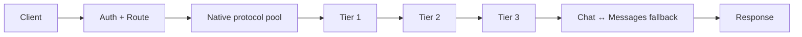

# ai-gateway

**Many APIs · many keys · many models · one resilient endpoint**

A lightweight AI API aggregation gateway for Cloudflare Workers. It routes multiple upstream APIs, credentials, and models behind one endpoint, with tiered failover, per-key traffic shaping, protocol-aware streaming, and conservative OpenAI/Anthropic fallback.

Current source version: **1.3.1**


[Quick start](#quick-start) · [Architecture](docs/architecture/overview.md) · [Configuration](docs/operations/configuration.md) · [Deployment](docs/operations/deployment.md) · [Documentation](docs/README.md) · [Governance](docs/governance/README.md)

## What it does

| Area | Current contract |
| --- | --- |
| Native APIs | OpenAI Chat Completions, OpenAI Responses, Anthropic Messages |
| Aggregation | Multiple providers, API keys, and logical models behind one gateway |
| Tier routing | Tier 1 → Tier 2 → Tier 3 |
| Tier 1 | Eligibility → soft Affinity → P2C, passive TTFT learning, RPM/concurrency heat protection |
| Failover | Rotates on rate limits, upstream failures, network errors, and pre-commit timeouts |
| Protocol fallback | OpenAI Chat ↔ Anthropic Messages only; OpenAI Responses is Native Only |
| Streaming | Protocol-specific first-event guards and guarded SSE forwarding |
| Observability | Sanitized diagnostics, token-usage aggregation, public model-status projection |



Native execution always comes first. Cross-protocol fallback begins only after the native pool is exhausted and shares the same logical-attempt and wall-clock failover budget. Hedge twins never cross protocol boundaries.

## Tier 1 resilience

Tier 1 is optimized for pools of independent keys where a single fast key should not become a hotspot.

- P2C avoids full-pool sorting.
- Passive per-`(account, model)` TTFT EWMA influences selection without creating active probes.
- Session affinity is advisory, not sticky routing.
- Hard RPM uses isolate-local smooth token-bucket admission.
- RPM headroom softly penalizes a key before the hard RPM gate is reached.
- Affinity bias decays toward neutral as RPM or concurrency pressure rises.
- Optional hedge twins require spare RPM and concurrency capacity.
- 429 recovery uses scoped cooldown/backoff; success rate is not rewarded as a routing signal.

These controls are best-effort per Worker isolate unless a Cloudflare distributed rate-limiting binding is configured. They are not a provider-wide globally consistent quota system.

## Protocol model

The gateway exposes:

| Method | Path | Surface |
| --- | --- | --- |
| `POST` | `/v1/chat/completions` | OpenAI Chat Completions |
| `POST` | `/v1/responses` | OpenAI Responses |
| `POST` | `/v1/messages` | Anthropic Messages |
| `POST` | `/v1/messages/count_tokens` | Local Anthropic-compatible token count |
| `GET` | `/v1/models` | Model catalog |
| `GET` | `/health` | Authenticated health diagnostics |
| `GET` | `/version` | Release and build identity |

The built-in fallback chain is bidirectional between Chat Completions and Messages. `PROTOCOL_FALLBACKS=disable` disables conversion fallback. OpenAI Responses never enters the conversion matrix.

Fallback conversion reports semantic fidelity as `exact`, `portable`, or `degraded` with fixed, non-sensitive diagnostics. Structured-output conversion uses a conservative Native → Tool → Prompt capability model; unknown target capability remains on the Prompt path rather than guessing wire support. See [Protocol model](docs/architecture/protocol-model.md).

## Quick start

Requirements: Node.js **>=22.18.0 <23** and a Cloudflare account for deployment.

```bash
git clone https://github.com/fongap/ai-gateway.git
cd ai-gateway
npm ci
sh scripts/install.sh
```

Windows:

```powershell
powershell scripts/install.ps1
```

For production, use the repository-driven workflow documented in [Deployment](docs/operations/deployment.md).

## Core configuration

Runtime nodes are delivered through tier-scoped configuration shards and credential shards. Credentials bind by **Tier + node id**; shard suffixes are independent.

```json
{
  "id": "node-01",
  "provider": "example",
  "protocol": "openai",
  "surfaces": ["chat_completions"],
  "base_url": "https://api.example.com/v1",
  "priority": 10,
  "models": { "code": "upstream-model" },
  "limits": { "concurrency": 3, "rpm": 40 }
}
```

Primary configuration families:

- `TIER{1,2,3}_NODES_CONFIG_01..10` — non-secret node configuration.
- `TIER{1,2,3}_NODES_SECRETS_01..10` — tier-scoped credentials keyed by node id.
- `GATEWAY_ACCESS_KEY_{AIR,PRO,MAX,ULTRA,AGENT}` — client gateway keys; configure at least one group.
- `GATEWAY_ACCESS_MODELS_{AIR,PRO,MAX,ULTRA,AGENT}` — per-group model allowlists.
- `MODELS_CONFIG` — logical model registry overrides.
- `POLICIES_CONFIG` — attempt, tier, and hedge policy overrides.

Gateway access is fail-closed: a configured group key with a missing or empty model allowlist grants no model access.

See [Configuration](docs/operations/configuration.md) for the complete runtime contract.

## Deliberate boundaries

ai-gateway intentionally does not turn every provider difference into a framework abstraction.

- Provider labels are metadata and known-quirk selectors, not model-capability authority.
- The Model Registry owns logical model capabilities and policy association.
- Provider Discovery is read-only advisory tooling and never changes runtime routing.
- Public Model Status is a read-only projection and never feeds the scheduler.
- OpenAI Responses remains native-only.
- Cross-isolate global concurrency is not claimed.

## Documentation

The documentation is English-canonical and organized by responsibility:

- [Architecture](docs/architecture/overview.md) — durable system boundaries and invariants.
- [Operations](docs/operations/configuration.md) — current configuration, deployment, and troubleshooting procedures.
- [Governance](docs/governance/README.md) — development, quality, release, dependency, and documentation rules.
- [CHANGELOG](CHANGELOG.md) and GitHub Releases — historical version changes.

`README_EN.md` is retained only as a compatibility link for older references; `README.md` is the canonical project landing page.

## Security

Do not place upstream credentials in node configuration or commit local secret files. See [SECURITY.md](SECURITY.md) for reporting and deployment requirements.

## License

MIT License. See [LICENSE](LICENSE).
