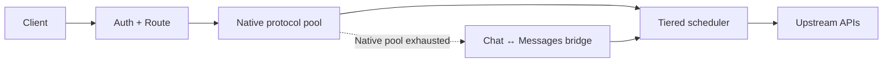

<div align="center">

# ai-gateway

### 面向 Cloudflare Workers 的高韧性 AI API 网关

多 Provider 路由 · 多 Key 负载均衡 · 限流保护 · 分层故障转移  
OpenAI Chat · OpenAI Responses · Anthropic Messages

[English](README.md) · [**简体中文**](README.zh-CN.md)


[实时面板](https://api.135468.xyz/) · [快速开始](#快速开始) · [架构](docs/architecture/overview.md) · [完整文档](docs/README.md)

</div>

在不同 AI Provider、API Key 与逻辑模型之上提供一个稳定入口。ai-gateway 面向高吞吐、上游易波动的使用场景，优先解决 **可用性、额度保护和可预测故障转移**，而不是持续追逐某一个最快的 Key。

> 本页为简体中文阅读版。项目长期文档以 [English README](README.md) 及英文 canonical docs 为准。

## 为什么是 ai-gateway

**高韧性路由。** 在同一请求预算内按 **Tier 1 → Tier 2 → Tier 3** 逐层托底，并结合 P2C、被动 TTFT 学习、RPM/并发整形、Cooldown、Affinity 与热点保护。

**协议感知故障转移。** 原生提供 OpenAI Chat Completions、OpenAI Responses 与 Anthropic Messages；支持 OpenAI Chat ↔ Anthropic Messages fallback，**OpenAI Responses 保持 Native Only**。

**可运营、可观察。** 提供流式首事件保护、脱敏诊断、Token Usage 聚合、模型状态展示，以及部署后的远程验证与失败自动 Worker 回滚。

适用于异构 OpenAI-compatible / Anthropic-compatible 上游，包括 Coding Agent 与 Claude Code 场景。[打开实时面板 →](https://api.135468.xyz/)

## 架构



始终优先执行原生协议。跨协议 fallback 与 native retry 共享同一 logical-attempt 和 wall-clock failover budget，Hedge twin 不跨协议。

Tier 1 的目标是 **稳定利用整个 Key 池，而不是持续追打某一个“最好”的 Key**。RPM headroom 会在硬上限前逐步降低热点 Key 的选择优势；Affinity 随热点程度衰减；可选 Hedge twin 只有在 RPM / concurrency 仍有余量时才允许触发。

## API Surface

| Method | Path | Surface |
| --- | --- | --- |
| `POST` | `/v1/chat/completions` | OpenAI Chat Completions |
| `POST` | `/v1/responses` | OpenAI Responses |
| `POST` | `/v1/messages` | Anthropic Messages |
| `POST` | `/v1/messages/count_tokens` | Anthropic-compatible 本地 Token 计数 |
| `GET` | `/v1/models` | 模型目录 |
| `GET` | `/health` | 鉴权后的健康诊断 |
| `GET` | `/version` | 源码版本与已部署 Build 标识 |

## 快速开始

要求：Node.js **>=22.18.0**；生产部署需要 Cloudflare 账户。

```bash
git clone https://github.com/fongap/ai-gateway.git
cd ai-gateway
npm ci
sh scripts/install.sh
```

Windows：

```powershell
powershell scripts/install.ps1
```

生产环境请使用 [Deployment](docs/operations/deployment.md) 中定义的仓库驱动部署流程。

## 配置模型

| 层级 | 配置 |
| --- | --- |
| Nodes | `TIER{1,2,3}_NODES_CONFIG_01..10` |
| 上游凭据 | `TIER{1,2,3}_NODES_SECRETS_01..10` |
| Gateway Access | `GATEWAY_ACCESS_KEY_{AIR,PRO,MAX,ULTRA,AGENT}` |
| Model Access | `GATEWAY_ACCESS_MODELS_{AIR,PRO,MAX,ULTRA,AGENT}` |
| 模型 / 请求策略 | `MODELS_CONFIG` · `POLICIES_CONFIG` |

凭据按 **Tier + node id** 绑定；Config 与 Secret 的 shard suffix 只是独立分片编号，不要求同号对应。Gateway Access 默认 fail-closed：某个 Group Key 已配置但对应模型 allowlist 为空时，该 Key 不获得任何模型访问权限。

完整 Node Schema、Runtime Variables、Protocol Fallback、RPM 行为和 Cloudflare Bindings 见 [Configuration](docs/operations/configuration.md)。

## 生产流程

```text
Pull Request
    ↓
validate-merge
    ↓
squash merge to main
    ↓
validate-deploy
    ↓
Worker deploy
    ↓
remote verification
    ↓
success / automatic Worker rollback
```

仅修改 Markdown / `docs/**` 的文档提交会跳过 Worker 重部署。

## 文档

| 区域 | 作用 |
| --- | --- |
| [Architecture](docs/architecture/overview.md) | 长期架构边界、路由、协议与可靠性契约 |
| [Operations](docs/operations/configuration.md) | 配置、部署、故障排查与 Provider Discovery |
| [Governance](docs/governance/README.md) | 开发、质量、依赖、版本/Tag 与文档治理 |
| [CHANGELOG](CHANGELOG.md) | 版本历史 |

英文是 canonical 文档语言；本页仅作为中文阅读入口。Executable behavior、tests、schemas 与英文 canonical docs 具有更高事实优先级。

## 安全

不要将上游凭据写入 Node Config 或公开日志。Secret 处理与漏洞报告方式见 [SECURITY.md](SECURITY.md)。

## License

MIT License，详见 [LICENSE](LICENSE)。
