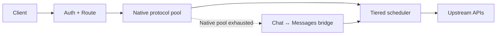

<div align="center">

# ai-gateway

**面向 Cloudflare Workers 的高韧性 AI API 网关**

多 Provider 路由 · 多 Key 负载均衡 · 限流保护 · 分层故障转移 · OpenAI / Anthropic 兼容

[English](README.md) · [**简体中文**](README.zh-CN.md)


[快速开始](#快速开始) · [架构](docs/architecture/overview.md) · [配置](docs/operations/configuration.md) · [部署](docs/operations/deployment.md) · [完整文档](docs/README.md)

</div>

ai-gateway 将不同 AI Provider、API Key 和逻辑模型聚合为一个稳定端点。它面向高吞吐、上游不稳定的使用场景，优先解决 **可用性、额度保护和可预测故障转移**，而不是一味追逐当前最快的 Key。

> 本页为简体中文阅读版。项目长期文档以 [English README](README.md) 及英文 canonical docs 为准。

## 核心能力

| 能力 | 当前行为 |
| --- | --- |
| **多 Provider 路由** | 将多个 Provider、API Key 和逻辑模型别名统一到一个网关 |
| **分层故障转移** | 在同一请求预算内按 **Tier 1 → Tier 2 → Tier 3** 逐层托底 |
| **多 Key 韧性** | P2C、被动 TTFT 学习、并发/RPM 整形、Cooldown 与热点保护 |
| **协议兼容** | 原生支持 OpenAI Chat、OpenAI Responses、Anthropic Messages |
| **安全转换** | 仅 OpenAI Chat ↔ Anthropic Messages；**OpenAI Responses 保持 Native Only** |
| **流式与观测** | 协议感知首事件保护、SSE 转发、脱敏诊断、Token Usage 聚合 |

适用于异构 OpenAI-compatible / Anthropic-compatible 上游，包括 Coding Agent 与 Claude Code 场景。

## 架构



始终优先执行原生协议。只有原生候选池耗尽后才进入跨协议 fallback；native retry 与 protocol fallback 共享同一 logical-attempt 和 wall-clock failover budget，Hedge twin 不跨协议。

Tier 1 的目标是 **稳定利用整个 Key 池，而不是持续追打某一个“最好”的 Key**。RPM headroom 会在硬上限前逐步降低热点 Key 的选择优势；Affinity 随热点程度衰减；可选 Hedge twin 只有在 RPM / concurrency 仍有余量时才允许触发。

## API Surface

| Method | Path | Surface |
| --- | --- | --- |
| `POST` | `/v1/chat/completions` | OpenAI Chat Completions |
| `POST` | `/v1/responses` | OpenAI Responses |
| `POST` | `/v1/messages` | Anthropic Messages |
| `POST` | `/v1/messages/count_tokens` | Anthropic-compatible 本地 Token 计数 |
| `GET` | `/v1/models` | 模型目录 |
| `GET` | `/health` | 鉴权后的健康诊断 |
| `GET` | `/version` | Release 与部署 Build 标识 |

## 快速开始

要求：Node.js **>=22.18.0 <23**；生产部署需要 Cloudflare 账户。

```bash
git clone https://github.com/fongap/ai-gateway.git
cd ai-gateway
npm ci
sh scripts/install.sh
```

Windows：

```powershell
powershell scripts/install.ps1
```

生产环境请使用 [Deployment](docs/operations/deployment.md) 中定义的仓库驱动部署流程。

## 配置模型

| 层级 | 配置 |
| --- | --- |
| Nodes | `TIER{1,2,3}_NODES_CONFIG_01..10` |
| 上游凭据 | `TIER{1,2,3}_NODES_SECRETS_01..10` |
| Gateway Access | `GATEWAY_ACCESS_KEY_{AIR,PRO,MAX,ULTRA,AGENT}` |
| Model Access | `GATEWAY_ACCESS_MODELS_{AIR,PRO,MAX,ULTRA,AGENT}` |
| 模型 / 请求策略 | `MODELS_CONFIG` · `POLICIES_CONFIG` |

凭据按 **Tier + node id** 绑定；Config 与 Secret 的 shard suffix 只是独立分片编号，不要求同号对应。Gateway Access 默认 fail-closed：某个 Group Key 已配置但对应模型 allowlist 为空时，该 Key 不获得任何模型访问权限。

完整 Node Schema、Runtime Variables、Protocol Fallback、RPM 行为和 Cloudflare Bindings 见 [Configuration](docs/operations/configuration.md)。

## 生产流程

```text
Pull Request
    ↓
validate-merge
    ↓
squash merge to main
    ↓
validate-deploy
    ↓
Worker deploy
    ↓
remote verification
    ↓
success / automatic Worker rollback
```

仅修改 Markdown / `docs/**` 的文档提交会跳过 Worker 重部署。

## 文档

| 区域 | 作用 |
| --- | --- |
| [Architecture](docs/architecture/overview.md) | 长期架构边界、路由、协议与可靠性契约 |
| [Operations](docs/operations/configuration.md) | 配置、部署、故障排查与 Provider Discovery |
| [Governance](docs/governance/README.md) | 开发、质量、依赖、Release 与文档治理 |
| [CHANGELOG](CHANGELOG.md) | 版本历史 |

英文是 canonical 文档语言；本页仅作为中文阅读入口。Executable behavior、tests、schemas 与英文 canonical docs 具有更高事实优先级。

## 安全

不要将上游凭据写入 Node Config 或公开日志。Secret 处理与漏洞报告方式见 [SECURITY.md](SECURITY.md)。

## License

MIT License，详见 [LICENSE](LICENSE)。
