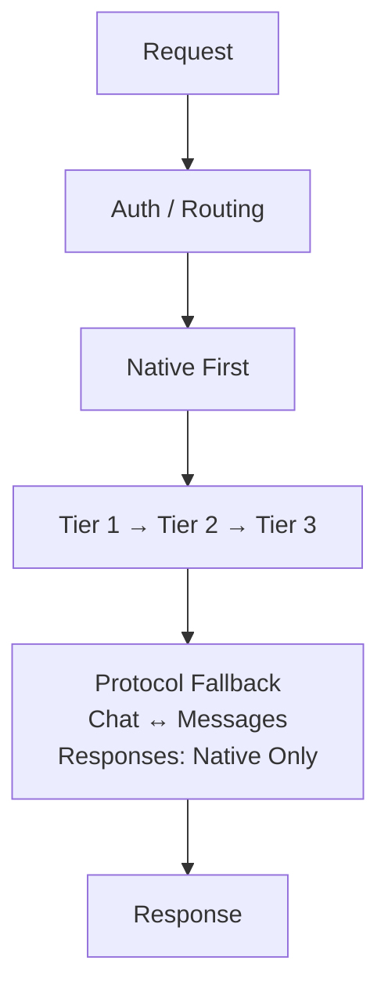

# ai-gateway

**Many APIs · many keys · many models · one endpoint**

Aggregate multiple AI APIs, keys, and models behind one endpoint with rate-limit handling, failover, and protocol fallback.


[Quick Start](#quick-start) · [Configuration](#configuration) · [API](#api) · [Docs](#docs) · [中文](README.md)



## Capabilities

| Capability | Description |
| --- | --- |
| Multi-protocol | OpenAI Chat / Responses, Anthropic Messages |
| Multi-node | Multiple APIs, keys, and models behind one endpoint |
| Tier routing | Tier 1 → Tier 2 → Tier 3 |
| Failover | Switches nodes on 429, 5xx, and timeouts |
| Protocol fallback | Chat ↔ Messages; Responses stays native |
| Session affinity | Tier 1 supports cross-isolate session binding |

## Quick Start

```bash
git clone https://github.com/fongap/ai-gateway.git
cd ai-gateway
npm ci
sh scripts/install.sh
```

Windows:

```powershell
powershell scripts/install.ps1
```

For production deployment, see [docs/operations/deployment.md](docs/operations/deployment.md).

## Configuration

```json
{
  "id": "node-01",
  "provider": "example",
  "protocol": "openai",
  "surfaces": ["chat_completions"],
  "base_url": "https://api.example.com/v1",
  "priority": 10,
  "models": {
    "code": "upstream-model"
  },
  "limits": {
    "concurrency": 3,
    "rpm": 40
  }
}
```

| Configuration | Purpose |
| --- | --- |
| `TIER*_NODES_CONFIG_*` | Node configuration |
| `TIER*_NODES_SECRETS_*` | Node credentials |
| `GATEWAY_ACCESS_KEY_*` | Gateway access keys |
| `MODELS_CONFIG` | Model configuration |
| `POLICIES_CONFIG` | Routing policies |

A Secret must belong to the same Tier as its node and bind by node id; 01..10 are shard numbers only.

## API

| Method | Path | Protocol / Purpose |
| --- | --- | --- |
| POST | `/v1/chat/completions` | OpenAI Chat |
| POST | `/v1/responses` | OpenAI Responses |
| POST | `/v1/messages` | Anthropic Messages |
| POST | `/v1/messages/count_tokens` | Anthropic Token Count |
| GET | `/v1/models` | Model list |
| GET | `/health` | Health check |

## Docs

| Topic | Document |
| --- | --- |
| Architecture | [Architecture overview](docs/architecture/overview.md) |
| Configuration | [Configuration](docs/operations/configuration.md) |
| Deployment | [Deployment](docs/operations/deployment.md) |
| Reliability | [Reliability model](docs/architecture/reliability-model.md) |
| Security | [Quality and security](docs/governance/quality-policy.md) |

## License

MIT License. See [LICENSE](LICENSE).
