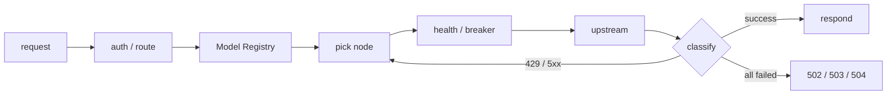

<div align="center">

# ai-gateway

**many APIs · many keys · many models · one stable endpoint**

Aggregate upstream APIs and keys — free or paid, prone to rate limits and outages — into one stable, self-healing AI endpoint.


[Local setup](#local-setup) · [Auto deploy](#auto-deploy) · [Config](#config) · [Endpoints](#endpoints) · [Security](#security)

</div>

---

## At a glance



## Core

| Rotation | 429 isolation | Self-healing | Tier fallback |
|---|---|---|---|
| priority + LRU | Retry-After cooldown | HALF_OPEN single probe | hard-precedence tiers |

- Multi-protocol: OpenAI Chat / Responses, Anthropic Messages / count_tokens
- `limits.rpm` defaults hard — never knowingly exceeds the configured quota within a single Worker isolate
- Whole-request failover budget; stops rotating once spent

## Local setup

```bash
git clone https://github.com/fongap/ai-gateway.git && cd ai-gateway
npm ci
sh scripts/install.sh     # Windows: powershell scripts/install.ps1
```

## Auto deploy

Production uses one encrypted GitHub repository Secret containing the runtime configuration package as its sole configuration source. After one-time setup, a push to `main` is all that is needed:

```bash
git push origin main
```

The workflow validates the runtime configuration package, synchronizes Worker text variables and Worker Secrets, applies D1 migrations, deploys the Worker, then performs live health checks on `/health`, `/v1/models`, and Claude `count_tokens`. It does not retain stale Cloudflare Dashboard text variables. See **[docs/DEPLOYMENT.md](docs/DEPLOYMENT.md)** for the one-time setup.

## Config

Node definitions are Worker text variables; upstream credentials and the gateway access key are Worker Secrets:

```json
{ "id": "nvidia-01", "provider": "nvidia", "priority": 10,
  "base_url": "https://integrate.api.nvidia.com/v1",
  "models": { "general-air": "deepseek-ai/deepseek-v3.1" },
  "limits": { "concurrency": 3, "rpm": 40 } }
```

| Configuration item | Purpose |
|---|---|
| `TIER{1,2,3}_NODES_CONFIG_01..` | node pools per tier |
| `NODE_SECRETS_01..` | `{ node-id: credential }` |
| `GATEWAY_ACCESS_KEY` | gateway access key |

> Full fields, runtime knobs, Model Registry, and the GitHub runtime configuration package example → **[docs/CONFIGURATION.md](docs/CONFIGURATION.md)**.

## Endpoints

| Method | Path | Meaning |
|---|---|---|
| POST | `/v1/chat/completions` | OpenAI Chat |
| POST | `/v1/responses` | OpenAI Responses |
| POST | `/v1/messages` · `/count_tokens` | Anthropic Messages |
| GET | `/` · `/version` | entry page · version |
| GET | `/health` `/metrics` `/v1/models` | diagnostics (authed) |

## Security

- Bearer / `x-api-key`, timing-safe; header allowlist; HTTPS enforced
- Credentials never leak; CORS off by default
- Topology hidden by default — responses expose only attempt count + `failure_kinds`

---

<div align="center">

**ai-gateway** · many keys · many models · one stable endpoint · [MIT](LICENSE)

[Architecture](docs/ARCHITECTURE.md) · [Configuration](docs/CONFIGURATION.md) · [Deployment](docs/DEPLOYMENT.md)

</div>
