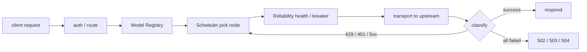
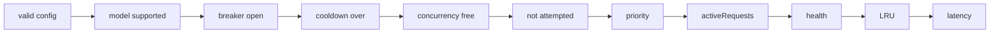

<div align="center">

# ai-gateway

**AI aggregation gateway — many APIs, many keys, many models, one stable endpoint**

Multi-key rotation · 429 isolation · circuit-breaker self-healing · tier fallback · streaming first-event guard


[Quick start](#quick-start) · [Node config](#node-config-plain-variables-never-credentials) · [Scheduling](#scheduling-behavior) · [Endpoints](#endpoints) · [Security](#security-model)

</div>

---

Aggregate upstream APIs and keys — free or paid, prone to rate limits, outages and jitter — into one stable, lightweight, self-healing AI endpoint. Clients see a single endpoint.

- OpenAI Chat Completions: `/v1/chat/completions`
- OpenAI Responses: `/v1/responses` (Codex / OpenCode compatible, with reasoning, function_call and a full streaming event lifecycle)
- Anthropic Messages / Claude Code: `/v1/messages`
- Anthropic token count: `/v1/messages/count_tokens`

No database, Redis, KV state sync, multi-tenancy, billing, or semantic cache. Runtime state is best-effort, isolate-local memory.

---

## Capabilities

| | Scheduling | Reliability | Protocol | Security |
|---|---|---|---|---|
| Selection | dynamic candidate set, O(n) recompute per attempt | 429 cooldown / Retry-After | Chat / Responses / Messages | Bearer / `x-api-key` timing-safe |
| Rotation | priority + LRU spread | circuit breaker | all upstreams via Chat Completions | header allowlist |
| Fallback | hard-precedence tiers | HALF_OPEN single probe | Responses / Messages converted in-gateway | credentials never leak |
| Throttling | `limits.rpm` defaults hard | no half-open probe leak | local Anthropic count_tokens | CORS off + CSP by default |

---

## Request pipeline



Responsibility split:

```text
Model Registry  = what a logical model can do
Node            = logical model → upstream model
Scheduler       = which node gets the request
Reliability     = is the node usable right now
Transport       = how to talk to the upstream
```

## Quick start

```bash
git clone https://github.com/fongap/ai-gateway.git
cd ai-gateway
npm ci
sh scripts/install.sh     # Windows: powershell scripts/install.ps1
```

`install` walks you through: Worker naming → validation → Cloudflare login → node config JSON → credential JSON → shard validation → deploy → secrets → online verification.

---

## Node config (plain variables, never credentials)

Typical setups are **multi-key, multi-account, multi-model**. This tier-1 example mixes providers across accounts serving several logical models:

```json
[
  { "id": "nvidia-01", "provider": "nvidia", "base_url": "https://integrate.api.nvidia.com/v1", "priority": 10,
    "models": { "general-air": "deepseek-ai/deepseek-v3.1", "code-pro": "qwen/qwen3-coder-480b" }, "limits": { "concurrency": 3, "rpm": 40 } },
  { "id": "nvidia-02", "provider": "nvidia", "base_url": "https://integrate.api.nvidia.com/v1", "priority": 10,
    "models": { "general-air": "deepseek-ai/deepseek-v3.1" }, "limits": { "concurrency": 3, "rpm": 40 } },
  { "id": "glm-01", "provider": "zhipu", "base_url": "https://open.bigmodel.cn/api/paas/v4", "priority": 20,
    "models": { "general-air": "glm-4.7", "code-max": "glm-4.7" }, "limits": { "concurrency": 2, "rpm": 30 } }
]
```

Matching credentials secret (`NODE_SECRETS_01`):

```json
{ "nvidia-01": "nvapi-xxx", "nvidia-02": "nvapi-yyy", "glm-01": "zzzz.id" }
```

Fields:

| Field | Meaning |
|---|---|
| `id` | stable key; `^[a-z0-9][a-z0-9-]{0,63}$`; unique repo-wide |
| `provider` | optional diagnostic label |
| `base_url` | must be `https://`; no embedded username/password |
| `priority` | lower = higher precedence, default 100; equal in-tier = LRU spread |
| `models` | logical → upstream model map; missing / empty `{}` = wildcard |
| `limits.concurrency` | per-node concurrency cap, default 2; **isolate-local** shaping, not a global limit |
| `limits.rpm` | per-minute quota. Default **hard**: an exhausted node is skipped, full exhaustion yields `503 + Retry-After`; `"rpm_mode": "soft"` restores legacy best-effort break-through |

Variables:

```text
TIER1_NODES_CONFIG_01, TIER2_NODES_CONFIG_01, ...   ← tier-1/2/3 pools (plain vars)
NODE_SECRETS_01, ...                                 ← Secrets: { "node-id": "credential" }
GATEWAY_ACCESS_KEY                                   ← Secret: client access key
```

- Tier comes only from the variable prefix; a `tier` field in node JSON is rejected.
- Shards stay under 4500 bytes and split at node boundaries.
- Pre-deploy validation: duplicate IDs, missing/orphan credentials, invalid URLs, and illegal fields (`prioirty`, `concurency`) fail fast — never guessed silently.

---

## Scheduling behavior



| Scenario | Behavior |
|---|---|
| Selection | single O(n) pass: priority ASC → activeRequests ASC → health (band) → LRU → latency ASC |
| Concurrency | parallel requests spread across concurrency-limited nodes |
| 429 | cools only the failing node, honors Retry-After (seconds/HTTP-date, clamped 1s–600s) |
| RPM quota | `limits.rpm` defaults **hard**: exhausted nodes are skipped, siblings with headroom preferred; full exhaustion → `503 + Retry-After` (minute boundary); `"rpm_mode":"soft"` allows break-through |
| Saturation | all candidates at concurrency/RPM caps → `503 + Retry-After`, so agent clients back off |
| Truncation | mid-stream death / idle timeout: buffered bytes delivered, node failed; clean close without `[DONE]` also counted as failure |
| 401/403 | credential problem: long node-local cooldown, excluded from the request |
| 400/413/415/422 | client error: returned immediately, no node rotation |
| 5xx/network/timeout | failure accounting → same-tier rotation → circuit after 3 consecutive |
| Tier fallback | next tier only when the current tier has no eligible node left |
| Recovery | cooldown expiry re-enters the pool; OPEN → HALF_OPEN single probe → CLOSED |
| Streaming | nodes may rotate before the first valid event only |

Circuit is a consecutive-failure state machine: CLOSED →(3× 5xx/network/timeout)→ OPEN →(30s)→ HALF_OPEN → single probe → CLOSED on success / OPEN on failure. 429/401 never count toward the circuit. A half-open probe ending in 429 / 401 / 404 / client abort is treated as proof of life: the circuit closes and the probe is released (never left stuck), and the node can be scheduled again once its cooldown expires.

---

## Configuration states

| State | Meaning |
|---|---|
| `unconfigured` | key config missing |
| `invalid` | structural conflict (duplicate IDs etc.) or zero usable nodes; **refuses service** (`ready=false`, requests return 500) |
| `degraded` | some nodes invalid but at least one servable |
| `ready` | all declared nodes usable |

`GET /health` (authed) returns per-node health/cooldown/circuit/concurrency snapshots plus config diagnostics.

---

## Runtime knobs (all optional)

| Variable | Default | Meaning |
|---|---|---|
| `MAX_BODY_BYTES` | 20 MiB | request body limit |
| `UPSTREAM_HEADERS_TIMEOUT_MS` | 120000 (5s–600s) | upstream headers timeout |
| `FIRST_EVENT_TIMEOUT_MS` | 60000 (5s–600s) | streaming first-event guard timeout |
| `STREAM_IDLE_TIMEOUT_MS` | 120000 (10s–600s) | streaming idle timeout |
| `RATE_LIMIT_COOLDOWN_MS` | 60000 (1s–600s) | 429 cooldown without Retry-After |
| `AUTH_FAIL_COOLDOWN_MS` | 3600000 (1min–7d) | 401/403 credential cooldown |
| `FAILOVER_BUDGET_MS` | 180000 (1s–900s) | whole-request failover budget; stops rotating with 504 once spent |
| `ALLOWED_ORIGIN` | unset | CORS fully off unless set |
| `EXPOSE_UPSTREAM_INFO` | false | true exposes node id/tier and per-attempt detail; default exposes only attempt count + aggregate `failure_kinds` |
| `FAKE_STREAM_PROTECTION` | false | convert non-stream requests to streaming upstream + reassemble |
| `ALLOW_INSECURE_HTTP_UPSTREAM` | false | allow http:// upstream (not recommended) |
| `MODELS_CONFIG` | — | the **Model Registry**: `{ "logical": { "policy", "capabilities", "reasoning_efforts" } }` |
| `POLICIES_CONFIG` | — | `{ "policy": { "max_attempts": 5 } }` |
| `LOG_LEVEL` | info | none/error/info/debug |

---

## Endpoints

| Method | Path | Meaning |
|---|---|---|
| GET | `/` | public service entry page (Smart AI Gateway; browser) |
| GET | `/version` | version info (public, branding only) |
| GET | `/health` `/metrics` `/v1/models` | diagnostics (authed) |
| POST | `/v1/chat/completions` | OpenAI Chat Completions |
| POST | `/v1/responses` | OpenAI Responses (Codex / OpenCode compatible) |
| POST | `/v1/messages` `/v1/messages/count_tokens` | Anthropic Messages |

`GET /v1/models` returns logical models plus capability metadata (`apiBackend`, `api_backends`, `protocols`, `supports_reasoning_effort`, `reasoning_efforts`, `supports_tools`, `supports_vision`, `supports_stream`). Capabilities come from the **Model Registry** (`MODELS_CONFIG`) and default conservatively (tools/reasoning/vision=false, stream=true) unless explicitly declared; `apiBackend` is `mixed` (with `api_backends`) when multiple backends serve the model. The extra fields are backward-compatible.

---

## Security model

- Bearer / `x-api-key` auth with timing-safe SHA-256 comparison.
- Strict header allowlist; upstream Authorization is built only from the runtime node credential.
- Terminal error responses carry `x-should-retry: false` (429/503 excluded — retryable via Retry-After).
- HTTPS-only upstreams by default; `redirect: 'manual'`.
- Credentials never appear in responses, logs or diagnostics.
- Use Cloudflare WAF / Rate Limiting rules for platform-level protection. Optionally bind a Cloudflare Rate Limiting binding as `QUOTA_RATE_LIMITER` for **per-location (per-PoP)** distributed shaping — note it counts per location, is permissive, and is **not** a strict global/account quota; exact per-node counts remain the job of local `limits.rpm` (hard mode).

---

## Performance

Candidate selection is a single O(n) scan before each attempt; static config is parsed once per isolate; each SSE event is parsed exactly once. `node benchmark/benchmark.mjs --quick` measures gateway overhead vs a direct mocked upstream (p50/p95/p99/RPS).

See [docs/ARCHITECTURE.md](docs/ARCHITECTURE.md) · [docs/CONFIGURATION.md](docs/CONFIGURATION.md) · [docs/DEPLOYMENT.md](docs/DEPLOYMENT.md).

---

<div align="center">

### ai-gateway

**many APIs · many keys · many models · one stable endpoint**

[MIT License](LICENSE)

</div>
