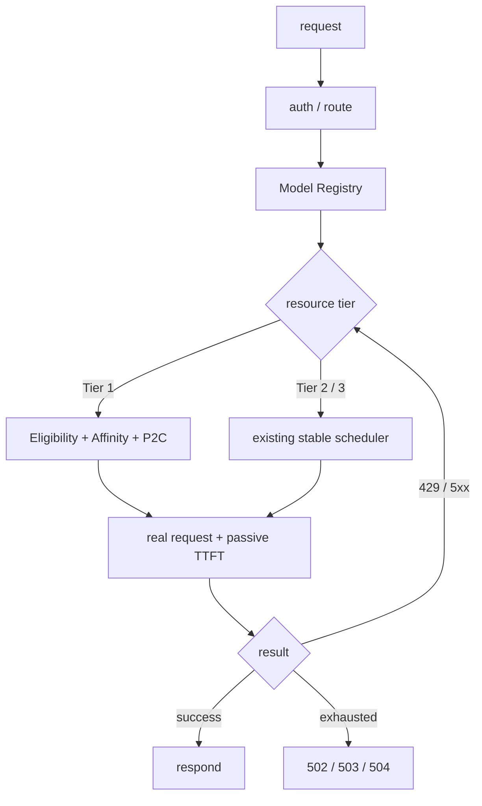

<div align="center">

# ai-gateway

**many APIs · many keys · many models · one stable endpoint**

Aggregate upstream APIs and keys — free or paid, prone to rate limits and outages — into one stable, self-healing AI endpoint.


[Local setup](#local-setup) · [Auto deploy](#auto-deploy) · [Config](#config) · [Endpoints](#endpoints) · [Security](#security)

</div>

---

## At a glance



## Core

| Tier 1 adaptation | 429 isolation | Passive recovery | Tier fallback |
|---|---|---|---|
| affinity + P2C | Retry-After cooldown | real-request HALF_OPEN | hard-precedence tiers |

- Multi-protocol: OpenAI Chat / Responses, Anthropic Messages / count_tokens
- Native protocol forwarding: Chat → upstream `/v1/chat/completions`, Responses → upstream `/v1/responses`, Messages → upstream `/v1/messages`; nodes declare `protocol` + `surfaces` explicitly
- No OpenAI ↔ Anthropic conversion and no cross-protocol failover
- `limits.rpm` defaults hard and is enforced best-effort within one Worker isolate
- One whole-request failover budget shared by Tier 1, Tier 2, and Tier 3
- Tier 1 learns per-`(account, model)` TTFT only from meaningful output in real requests. It uses no active probes, health score, LRU, or static-priority ordering. It does not promise the globally fastest account on every request; it targets stability, low cost, fast avoidance, natural balance, and session continuity.
- Tier 1 session affinity is stored in Cloudflare KV so it works across isolates. Short-lived TTFT, in-flight, cooldown, and half-open state remains isolate-local best-effort state.
- Tier 2 and Tier 3 keep the existing stable fallback and circuit behavior.

## Local setup

Create a Cloudflare KV namespace for Tier 1 affinity, then run the installer and provide its 32-character namespace ID when prompted:

```bash
git clone https://github.com/fongap/ai-gateway.git && cd ai-gateway
npm ci
sh scripts/install.sh     # Windows: powershell scripts/install.ps1
```

## Auto deploy

Production stores fork-specific non-sensitive Worker configuration in GitHub repository Variables and credentials in GitHub repository Secrets. Set the required `TIER1_AFFINITY_KV_ID` Variable, then push `main`:

```bash
git push origin main
```

The workflow validates configuration, synchronizes Worker variables and Secrets, applies D1 migrations, deploys the Worker, and runs live health checks. See **[docs/operations/deployment.md](docs/operations/deployment.md)**.

## Config

Node definitions are Worker text variables; upstream credentials and the gateway access key are Worker Secrets:

```json
{ "id": "free-01", "provider": "example", "priority": 10,
  "base_url": "https://api.example.com/v1",
  "models": { "general-air": "upstream-model" },
  "limits": { "concurrency": 3, "rpm": 40 } }
```

| Configuration item | Purpose |
|---|---|
| `TIER{1,2,3}_NODES_CONFIG_01..` | node pools per tier |
| `NODE_SECRETS_01..` | `{ node-id: credential }` |
| `GATEWAY_ACCESS_KEY` | gateway access key |
| `TIER1_AFFINITY` | required Cloudflare KV binding for hashed session key → Tier 1 account |

`priority` remains part of the shared node schema for Tier 2/3 compatibility, but Tier 1 P2C ignores it.

> Full fields, runtime behavior, Model Registry, and deployment examples → **[docs/operations/configuration.md](docs/operations/configuration.md)**.

## Endpoints

| Method | Path | Meaning |
|---|---|---|
| POST | `/v1/chat/completions` | OpenAI Chat |
| POST | `/v1/responses` | OpenAI Responses |
| POST | `/v1/messages` · `/count_tokens` | Anthropic Messages |
| GET | `/` · `/version` | entry page · version |
| GET | `/health` `/metrics` `/v1/models` | diagnostics (authenticated) |

Clients may send `x-session-id` (8–128 characters) to enable Tier 1 session affinity. The raw value is SHA-256 hashed before it becomes a KV key and is never logged.

## Security

- Bearer / `x-api-key`, timing-safe; header allowlist; HTTPS enforced
- Credentials never leak; CORS is off by default
- Topology is hidden by default; session IDs are not written into KV keys or logs

---

<div align="center">

**ai-gateway** · many keys · many models · one stable endpoint · [MIT](LICENSE)

[Architecture](docs/architecture/overview.md) · [Configuration](docs/operations/configuration.md) · [Deployment](docs/operations/deployment.md)

</div>
